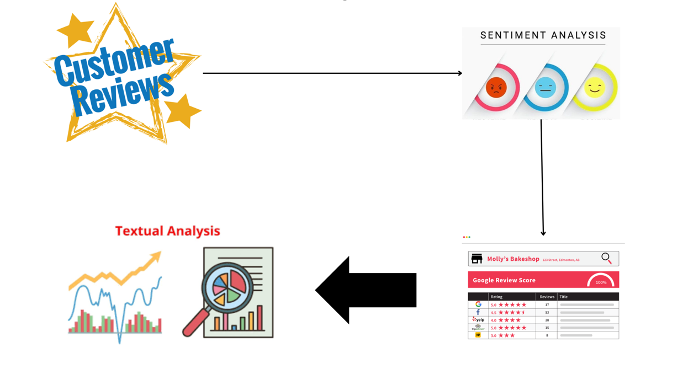
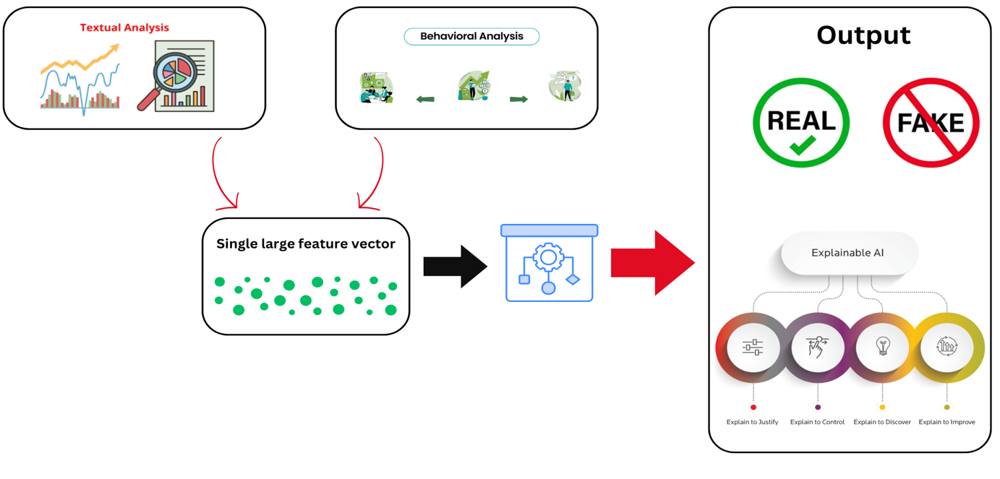

# Trustworthy Reviewer Scoring System for Detecting Fake Reviews

## 📑 Overview

Fake reviews pose a significant challenge to online trust and transparency in e-commerce platforms. Malicious actors can manipulate customer reviews to mislead consumers and unfairly promote products or services. Our research project aims to develop a robust and efficient system for detecting fake reviews using natural language processing (NLP) techniques and behavioral analysis.

The project addresses the limitations of traditional methods that rely solely on textual analysis by proposing a multi-pronged approach that combines:

- **Textual Analysis**: Advanced NLP techniques to detect linguistic patterns in fake reviews
- **Behavioral Feature Analysis**: Analysis of reviewer activity and patterns 
- **Sentiment-Rating Mismatch Detection**: Identifying inconsistencies between text sentiment and numeric ratings
- **Readability-Based Validation**: Detection of robotic or templated writing styles
- **Explainable AI**: Providing transparent reasoning for review classification

This combined approach is expected to improve the accuracy and robustness of fake review detection compared to traditional methods and contribute to building a more trustworthy online environment for consumers and businesses alike.

## 🔍 Research Problem

Online e-commerce platforms generate massive amounts of user-generated content, including reviews that significantly influence consumer purchasing decisions. However, the integrity of these review systems is compromised by:

1. **Prevalence of Fake Reviews**: Increasing numbers of artificially generated positive and negative reviews distorting product perceptions
2. **Limited Detection Capabilities**: Current methods often rely solely on textual analysis, missing behavioral patterns
3. **Lack of Transparency**: Existing detection systems don't provide explanations for their decisions
4. **Robotic Review Generation**: AI-generated reviews that are increasingly difficult to distinguish from genuine ones
5. **Trust Deficit**: Declining consumer confidence in online review systems

These challenges necessitate a comprehensive approach that can analyze both the content of reviews and the behavior patterns of reviewers while providing transparent explanations for its decisions.

## 🏆 Team Registry

| **Name with initials** | **Registration Number** | **Contact Phone Number** | **Email** | **Badge** |
|:----------------------:|:----------------------:|:------------------------:|:---------:|:---------:|
| Jayawardhana R.A.D.G.S | IT20137946 | 0712696233 | it20137946@my.sliit.lk |  |
| Dissanayaka S.D | IT21827662 | 0774487666 | it21827662@my.sliit.lk |  |
| Thathsarani H. A. N. N | IT21237522 | 0773747615 | it21237522@my.sliit.lk |  |

## 💡 Proposed Solution

Our solution is a comprehensive system that combines textual analysis, behavioral patterns, and explainable AI to detect fake reviews with high accuracy. The system utilizes:

1. **Multi-Layer Analysis**: Combining textual content and reviewer behavior patterns
2. **Advanced NLP Techniques**: Leveraging transformer models and sentiment analysis
3. **Trustworthy Reviewer Scoring**: Developing a scoring mechanism to rate reviewer credibility
4. **Hybrid Validation Approach**: Fusing multiple indicators for more accurate detection
5. **Explainable Decision-Making**: Providing transparent reasoning for classifications

The system addresses key limitations of traditional approaches by incorporating behavioral analysis alongside textual analysis and providing human-understandable explanations for its decisions.

## 🔍 Project Components

### 1. Textual Content Analysis Using NLP (Dissanayaka S.D)

This component aims to develop a reliable and efficient textual analysis system for detecting fake reviews by leveraging advanced Natural Language Processing (NLP) techniques. The system:

- Analyzes linguistic patterns, semantic meaning, and sentiment inconsistencies
- Extracts rich textual features, including TF-IDF scores, word embeddings, and readability metrics
- Uses transformer-based models for more accurate classification
- Detects sentiment-rating mismatches to identify potential fake reviews
- Employs readability metrics to identify robotic or templated writing styles

**Key Research Questions:**
- Why do traditional methods fail to detect fake reviews effectively?
- What is the impact of sentiment-rating mismatches in detection?

**Process Flow:**
1. Preprocess review text using NLP techniques
2. Extract linguistic and semantic features
3. Compute readability metrics to identify robotic writing
4. Detect mismatches between text sentiment and numeric ratings
5. Train and evaluate machine learning models

### 2. Fake Reviewer Detection System (Jayawardhana R.A.D.G.S)

This component focuses on detecting fake reviewers by analyzing behavioral patterns and metadata. The system:

- Performs behavioral feature analysis to identify suspicious activity patterns
- Analyzes metadata to detect anomalies in user behavior
- Develops a trust score based on review history and account activity
- Implements anomaly detection algorithms to identify outliers
- Creates a trustworthy reviewer scoring system to rank reviewers by reliability

**Process Flow:**
1. Identify textual, behavioral and account-based features
2. Collect the dataset and pre-process it
3. Conduct model selection, training and anomaly detection
4. Evaluate with anomaly scoring and thresholding
5. Implement post-processing interpretation and visualization
6. Develop trustworthy reviewer scoring system

### 3. Fusion-Based Hybrid Validation System (Thathsarani H.A.N.N)

This component combines textual and behavioral features into a unified system for more accurate fake review detection. The system:

- Integrates textual and behavioral features into a unified feature space
- Normalizes and standardizes features to ensure comparability
- Experiments with various machine learning algorithms for optimal performance
- Utilizes explainable AI techniques like SHAP to interpret model decisions
- Provides human-understandable explanations for the model's output

**Key Research Questions:**
- How can we accurately detect fake reviews using a hybrid approach?
- How can we ensure trust in the model's decisions?

**Process Flow:**
1. Combine textual and behavioral features into a unified feature set
2. Normalize and standardize features to ensure comparability
3. Handle missing values and outliers
4. Experiment with different machine learning algorithms
5. Train and evaluate models using appropriate metrics
6. Fine-tune hyperparameters to optimize performance
7. Utilize SHAP to interpret model decisions
8. Visualize feature importance and decision boundaries
9. Provide human-understandable explanations

## 🛠️ Technology Stack

- **Programming Languages**: Python, R
- **NLP Libraries**: NLTK, spaCy, Transformers
- **Machine Learning Frameworks**: TensorFlow, PyTorch, scikit-learn
- **Data Processing**: Pandas, NumPy
- **Visualization**: Matplotlib, Seaborn, Plotly
- **Explainable AI**: SHAP, LIME
- **Development Tools**: Jupyter Notebook, VS Code, Git

## 📑 Research Comparison

### Textual Content Analysis

| Aspect | Research A | Research B | Research C | Research D | Research E | Our Approach |
|:-------|:-----------|:-----------|:-----------|:-----------|:-----------|:-------------|
| Sentiment Analysis | ✓ | ✗ | ✗ | ✓ | ✓ | ✓ |
| Readability Metrics | ✗ | ✗ | ✗ | ✗ | ✗ | ✓ |
| Explainable AI | ✗ | ✗ | ✗ | ✗ | ✗ | ✓ |

### Fake Reviewer Detection

| Feature | Research A | Research B | Research C | Our System |
|:--------|:-----------|:-----------|:-----------|:-----------|
| Fake review detection | Yes | No | Yes | Yes |
| Rating scoring system | No | No | No | Yes |
| Fake reviewer identify | Yes | No | No | Yes |

### Fusion-Based Hybrid Validation System
| Feature | Research A | Research B | Research C | Our System |
|:-------|:-----------|:-----------|:-----------|:-----------|
| Textual Analysis via NLP | ✓ | ✗ | ✗ | ✓ |
| Analyzes  | ✗ | ✓ | ✗ | ✓ |
| Hybrid Approaches | ✗ | ✗ | ✓ | ✓ |
| Explainable AI(XAI) | ✗ | ✗ | ✗ | ✓ |

## 🎯 Objectives

### Main Objective
- Develop a robust and accurate system for detecting fake online reviews

### Sub-Objectives
- Develop an efficient textual content analysis model using advanced NLP techniques
- Create a behavioral analysis system to identify suspicious reviewer patterns
- Build a hybrid validation system combining textual and behavioral features
- Implement explainable AI techniques for transparent decision-making

## 🌐 Target Audience and Applications

- **E-commerce Platforms**: Amazon, eBay, Alibaba
- **Review Websites**: Yelp, TripAdvisor, Google Reviews
- **Product Manufacturers**: Quality assurance and brand protection
- **Consumers**: Browser extensions for fake review detection

## 📝 License

[MIT License](LICENSE)

## 📚 References

1. Moawesh, H., & Xu, L. (2020). Fake Reviews Detection: A Survey. In 2020 2nd International Conference on Artificial Intelligence and Computer Science (AICS) (pp. 1-6). IEEE.
2. Ott, M., Choi, Y., Cardie, C., Hancock, J. T., & Turney, P. D. (2011). Finding deceptive opinion spam by any stretch of the imagination. In Proceedings of the 49th Annual Meeting of the Association for Computational Linguistics.
3. Xu, Y., Li, Y., Tian, Y., & Liu, Y. (2022). Fake Review Detection Model Based on Comment Content and Review Behavior. Sensors, 13(21), 4322.
4. Carcillo, S., & Gómez-Hernández, J. A. (2020). Fake Review Detection Using Transformer-Based Neural Networks. arXiv preprint arXiv:2003.00807.
5. Lundberg, S. M., & Lee, S.-I. (2017). A unified approach to interpreting model predictions. In Advances in neural information processing systems (pp. 4765-4774).
6. Jindal, N., Liu, B., & Yu, P. S. (2010). Opinion spam and analysis. In Proceedings of the 14th ACM SIGKDD international conference on Knowledge discovery and data mining (pp. 219-228).
7. Liu, B., Zhang, L., Cheng, X., & Le, J. (2012). Deceptive opinion spam detection. In Proceedings of the 22nd international conference on World Wide Web (pp. 645-654).
8. Akoglu, L., Tong, H., & Koutra, D. (2015). Graph-based anomaly detection in social media. In IEEE International Conference on Data Mining (pp. 807-816).
9. Hameed, W., Allami, R., & Ali, Y. H. (2023). Fake Review Detection Using Machine Learning. Revue d'Intelligence Artificielle, 37(5), 1159–1166.
